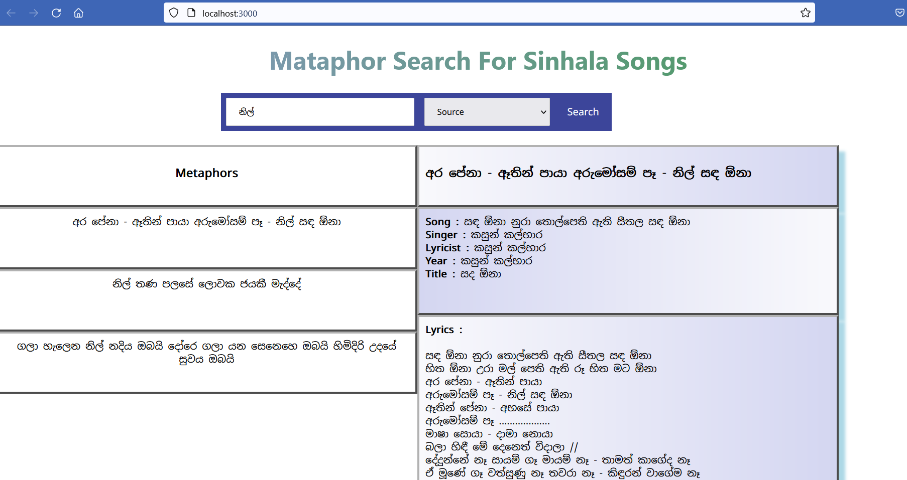

# Mataphor Search For Sinhala Songs

A project done for module CS4642 - Data Mining &amp; Information Retrieval

## Introduction

This application for search songs from metaphors which are phrases with different meaning than tha exact text meaning.



This repository contains the source code for a Sinhala Song Metaphor Search Engine developed using [ElasticSearch](https://www.elastic.co/) as the search engine and [NodeJS](https://nodejs.org/en/) and [React](https://reactjs.org/) as the web frameworks.

The Sinhala Songs corpus includes roughly 140 songs that have at least one Metaphor. The search engine offers following features for the users.

1. Search songs and metaphors based on source and target domain of metaphors.
3. Get Song details while searching metaphors.

## Project Structure
```
|___data.json - data file with sinhala songs
|___mapping_file.json - mapping file for the data_file.json file
|___Backend - back end system
|___frontend - the front end UI of the system
```

## Data fields
* Title_En
* Title_Si
* Artist_En
* Artist_Si
* Year
* metaphors
    * Metaphor
    * Meaning
    * Source
    * Target

## Prerequisites

* ElasticSearch v8.5.3
* Kibana v8.5.3 (Optional)
* NodeJS v14.15.4

## Setup

1. After downloading ElasticSearch install [ICU Analysis](https://www.elastic.co/guide/en/elasticsearch/plugins/current/analysis-icu.html) plugin.
2. Run an elasticsearch instance on port 9200.
3. Clone the repositary and go to the directory to create an index named `sinhala-songs` in the Elasticsearch using below curl requests.
    ```
    curl -X PUT "localhost:9200/sinhala-songs?pretty" -H "Content-Type: application/json" -d @mapping.json --user "elastic:your elastic password"

    curl -X POST "localhost:9200/sinhala-songs/_bulk?pretty" -H "Content-Type: application/json" --data-binary @data_file.json --user "elastic:your elastic password"
    ```
4. Add your elastic user password in the [SearchEngine](./Backend/SearchEngine.js) file.
5. Run `npm install` followed by `nodemon index.js` inside Backend directory.
6. Run `npm install` followed by `npm start` inside frontend directory.
7. Open the browser and goto `localhost:3000`
